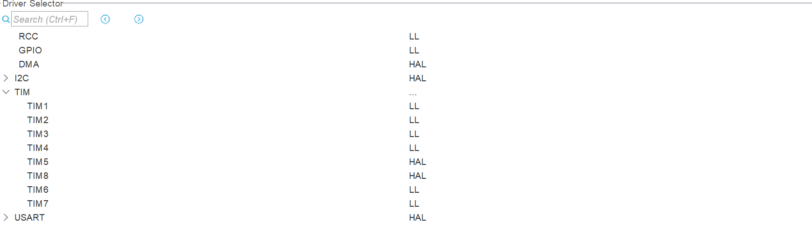

# 机器人方案设计制作大赛 - 电控软件

## 项目简介
本项目基于 **STM32CubeMX + VS Code + STM32CubeIDE for VS Code + Cortex-Debug** 开发，面向机器人方案设计制作大赛电控任务。

## 核心设计与技术选型 
1. **底盘与测速闭环**
   采用麦克纳姆轮底盘。为控制成本，使用定时器编码器接口进行电机转速采集，并结合 **PID** 算法实现速度闭环控制。

2. **MCU 选型**  
   选用 **STM32F103RCT6**，以满足项目对定时器资源数量与外设并行能力的需求。

3. **HAL + LL 混合开发策略**  
   - 简单且高频路径优先使用 LL 库，降低函数开销、提升执行效率。
   - 复杂流程优先使用 HAL 库，缩短开发周期。

     

4. **I2C 通信策略**
项目中 I2C 设备仅为 **TSC34725**，且通信频率不高，因此采用硬件 I2C：
   - 规避软件 I2C 带来的时序与占用问题；
   - 保证通信速率与稳定性。

5. **函数调用与代码组织优化**
   - 通过精简部分函数逻辑并适度使用 `__STATIC_INLINE`，减少调用开销，进一步优化执行效率。
   - 将大量宏定义存入 `config.h`，便于调试与修改。

6. **算法优化**
   - 鉴于 **STM32F103RCT6** 基于 ***Cortex-M3*** 内核，未配备硬件 *FPU* ，直接使用浮点运算会产生较大的软件库开销，
     本项目大部分算法使用**定点化**重构。重构的算法有：
      - **电机和红外循迹PID**
      - **TSC34725的RGB值读取**
